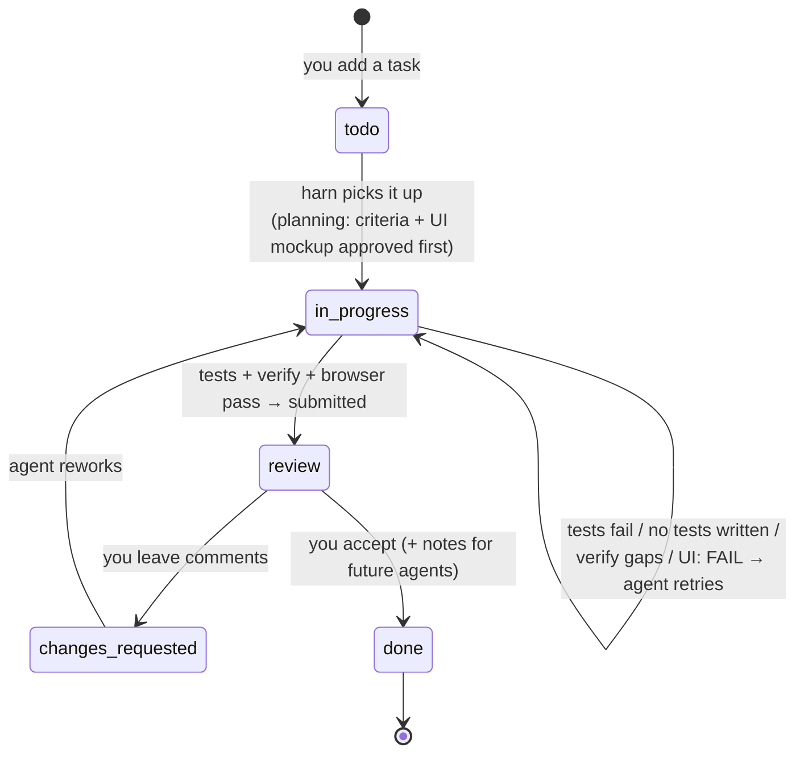

# harn — flow & task lifecycle

How a user interacts with harn in their project, and how each task moves through
its transparent track. See [README.md](./README.md) for setup steps and the
[harn_example/](./harn_example/) folder for the real `harn_env/` structure.

## Per-task lifecycle

Every task is one Markdown file in `harn_env/tasks/`. Its `status:` line walks
this track, and the whole thread (review comments + acceptance notes) is appended
to the file so context travels with the task to any future agent.



## End-to-end interaction

```mermaid
sequenceDiagram
    actor User as 👤 User
    participant CLI as harn CLI
    participant Loop as loop.py
    participant Adapter as Adapter<br/>(claude/codex/cursor/antigravity)
    participant MCP as MCP server<br/>(harn mcp)
    participant Agent as Agent CLI<br/>(claude -p / codex exec / …)
    participant TG as Telegram

    User->>CLI: harn setup
    CLI-->>User: harn_env/, AGENTS.md, .mcp.json

    User->>CLI: edit harn.toml · add tasks (create_task → JSON)
    User->>CLI: harn run
    CLI->>Loop: run(project_root, env_dir)

    loop Until DONE / BLOCKED / REVIEW / iteration limit
        Loop->>Loop: next_task()<br/>(resume in_progress → rework → new)
        Loop->>Loop: status = in_progress · log to PROGRESS.md
        Loop->>Adapter: run_turn(loop-aware prompt)

        Note over Loop,Agent: Prompt carries AGENTS.md +<br/>task board + PROGRESS + prior answers,<br/>so ANY agent has full context

        Adapter->>Agent: launch headless turn
        Agent->>MCP: board / get_next_task / read_skill / run_tests
        MCP-->>Agent: shared state

        alt Agent unsure
            Agent->>MCP: ask_user("question?")
            MCP->>MCP: write BLOCKED.md
            Loop->>TG: post question (wait_for_reply)
            TG-->>User: 🟡 question (survives sleep)
            User->>TG: reply
            TG-->>Loop: answer (long-poll)
            Loop->>Loop: record answer · resume task
        else Tests fail
            Loop->>Loop: keep in_progress · loop to fix
        else Code changed without tests
            Loop->>Loop: one "write tests" nudge · loop
        else UI task ([browser] enabled)
            Loop->>Loop: start app_cmd · wait for app_url
            Adapter->>Agent: UI-verify turn (Playwright MCP)
            Agent->>Agent: walk criteria in the live app ·<br/>compare vs design mockup · screenshots
            Loop->>Loop: UI: FAIL → rework · UI: PASS → continue
        else Turn done + tests pass
            Loop->>Loop: status = review · submit
            Loop->>TG: 👀 review request (wait_for_reply)
            TG-->>User: review card
            alt User approves
                User->>TG: "approve <notes>"
                TG-->>Loop: accept
                Loop->>Loop: status = done<br/>+ Notes for future agents
            else User wants changes
                User->>TG: "<what to change>"
                TG-->>Loop: changes
                Loop->>Loop: status = changes_requested<br/>(comment saved) → agent reworks
            end
            Note over Loop,TG: Without Telegram, harn notifies and<br/>waits for: harn review <id> --approve|--changes
        end
    end

    Loop-->>CLI: phase = DONE (all accepted)
    CLI-->>User: harn board · harn status
```

## Phases vs. task statuses

- **Loop phase** (`state/STATE.json`): `PLANNING → READY → EXECUTING →
  VERIFYING → UI_VERIFYING → BLOCKED → REVIEW → DONE` — the overall run.
- **Task status** (each `tasks/*.json`): `todo → in_progress → review →
  changes_requested → done` — one task's journey.
